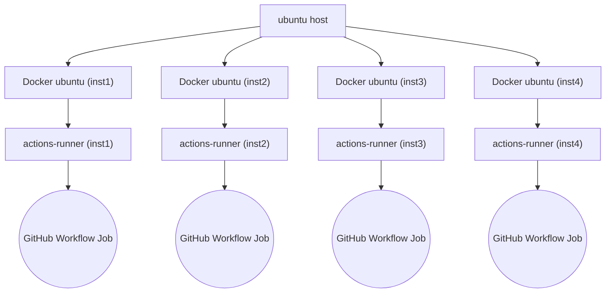
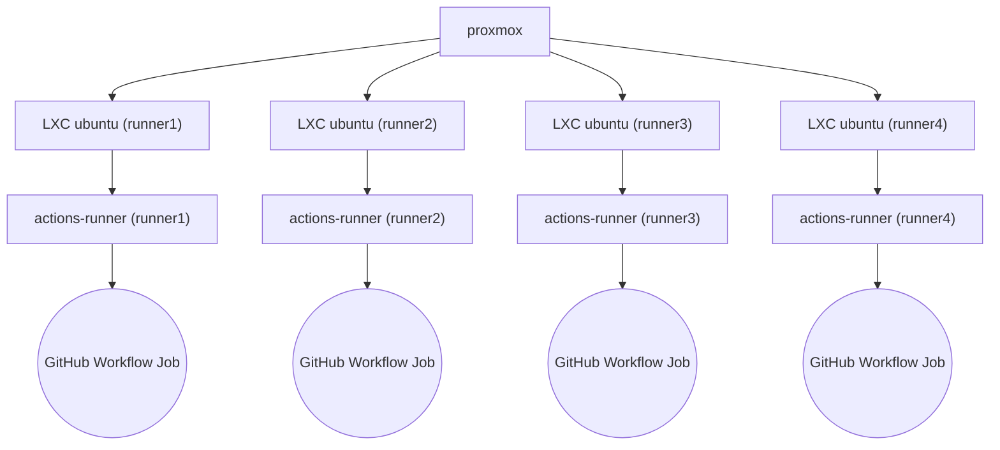

# Using LibreELEC GitHub Actions

The LibreELEC CI/CD is built on **GitHub Actions Workflows** and provides continuous delivery
of nightly and release **images** and **addons** for all supported hardware targets.

---

## Active Branches

| LE Release | Source Branch    | Scheduled Builds |
|------------|------------------|------------------|
| LE 13      | `master`         | Daily (images 14:15 UTC, addons 03:15 UTC) |
| LE 12.2    | `libreelec-12.2` | Manual only |
| LE 12      | `libreelec-12.0` | Manual only |
| LE 11      | `libreelec-11.0` | Manual only (EOL) |
| LE 10      | `libreelec-10.0` | Manual only (EOL) |

---

## Workflows

### Build images — `build-LE<version>.yml`

Triggers nightly image builds across all hardware targets for a given LE version.
Can also be triggered manually with an optional target filter and git ref override.
Calls `yml-uses-make-image-LE<version>.yml` for each target.

### Build addons — `build-LE<version>-addons.yml`

Triggers addon builds for a given LE version across all platforms.
Can be triggered manually with an optional target filter.
Calls `yml-uses-create-addon-LE<version>.yml` for each platform.

### Deploy addons — `deploy-addons.yml`

Manually triggered. Select an LE release from the dropdown; the workflow reads
`ADDON_VERSION` from the corresponding source branch of `LibreELEC.tv` and
runs `scripts/update_addon_repo.sh` on the addon server via SSH to sync the
staged addons into the live addon repository.

### Update package — `update-package.yml`

Automated package version bump workflow. Uses a GitHub App (`GH_APP_ID` /
`GH_APP_PRIVATE_KEY`) to open pull requests for package updates.

### Update repo — `update-repo.yml`

Automated repository update workflow.

### Tools

| Workflow | Purpose |
|----------|---------|
| `z: Check YAML` | Lint all workflow YAML files via actionlint |
| `z: Update changelog` | Regenerate `changelog.html` from GitHub commit history |
| `z: Update cacert.pem` | Update the CA certificate bundle |
| `z: Cleanup images archive` | Prune old nightly images on the upload server (keeps 200 builds) |

---

## Required Secrets

Configure these in the repository **Settings → Secrets and variables → Actions**.

### Addon server

| Secret | Purpose |
|--------|---------|
| `ADDONS_HOST` | Hostname of the addon server |
| `ADDONS_HOST_PORT` | SSH port |
| `ADDONS_HOST_USERNAME` | SSH user |
| `ADDONS_UPLOAD_PATH` | Staging path for built addon zips |
| `ADDONS_REPO_WEBHOOK_URL` | Slack incoming webhook URL for addon notifications |
| `ADDONS_REPO_WEBHOOK_CHANNEL` | Slack channel for addon notifications |

### Nightly image server

| Secret | Purpose |
|--------|---------|
| `NIGHTLY_HOST` | Hostname of the nightly image server |
| `NIGHTLY_HOST_PORT` | SSH port |
| `NIGHTLY_HOST_USERNAME` | SSH user |
| `NIGHTLY_UPLOAD_PATH` | Upload path on the nightly server |

### Release image server

| Secret | Purpose |
|--------|---------|
| `RELEASES_HOST` | Hostname of the releases server |
| `RELEASES_HOST_PORT` | SCP port |
| `RELEASES_USERNAME` | SCP user |
| `RELEASES_UPLOAD_PATH` | Upload path on the releases server |

### GitHub App

| Secret | Purpose |
|--------|---------|
| `GH_APP_ID` | GitHub App ID for opening automated PRs |
| `GH_APP_PRIVATE_KEY` | GitHub App private key |

---

## Deploying Addons

1. Go to **Actions → Deploy: Addons** and click **Run workflow**
2. Select the LE release from the dropdown (e.g. `LE 13`)
3. The workflow reads `ADDON_VERSION` from the source branch of `LibreELEC.tv`
   and deploys any staged addons to the live addon repository

Build failures during addon or image builds are reported to Slack automatically.

---

## Runner Setup

Both deployment models run self-hosted runners with the `nightly` label.
Each runner requires a `DATA` filesystem mounted at `/var/media/DATA/github-actions`
with `build-root/`, `sources/`, and `target/` subdirectories.

- [Deploy runners as Docker containers on Ubuntu](build-docker-gha-runner.md)

- [Deploy runners as LXC containers on Proxmox](build-lxc-gha-runner.md)

