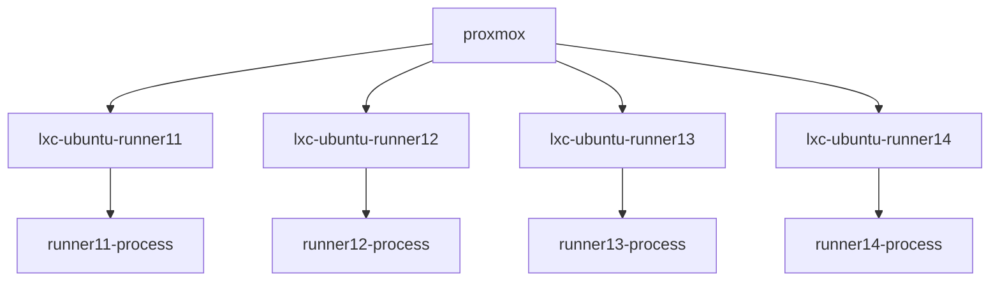

# Building LibreELEC
## Using GitHub Actions Workflows CI/CD
- [Build github actions runner/s as docket container/s](build-docker-gha-runner.md)
```mermaid
graph TD;
    ubuntu[ubuntu 22.04 host os]-->docker-ubuntu-runner11[Docker ubuntu with actions-runner (inst1) ];
    ubuntu[ubuntu 22.04 host os]-->docker-ubuntu-runner12[Docker ubuntu with actions-runner (inst2) ];
    ubuntu[ubuntu 22.04 host os]-->docker-ubuntu-runner13[Docker ubuntu with actions-runner (inst3) ];
    ubuntu[ubuntu 22.04 host os]-->docker-ubuntu-runner14[Docker ubuntu with actions-runner (inst4) ];
    docker-ubuntu-runner11-->ghaj1((GitHub Workflow Job));
    docker-ubuntu-runner12-->ghaj2((GitHub Workflow Job));
    docker-ubuntu-runner13-->ghaj3((GitHub Workflow Job));
    docker-ubuntu-runner14-->ghaj4((GitHub Workflow Job));
```
- [Deploy a github actions runner on LXC (one per LXC)](build-lxc-gha-runner.md)

