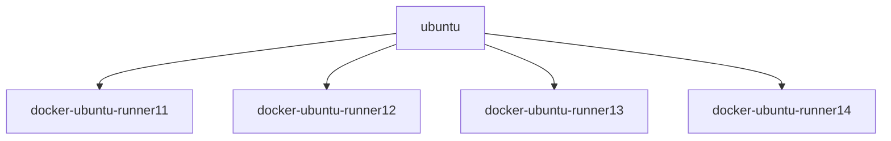
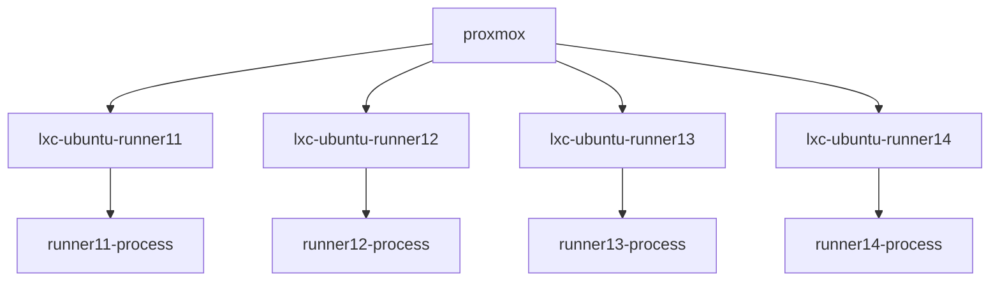

# Building LibreELEC
## Using GitHub Actions Workflows CI/CD
- [Build github actions runner/s as docket container/s](build-docker-gha-runner.md)

- [Deploy a github actions runner on LXC (one per LXC)](build-lxc-gha-runner.md)

