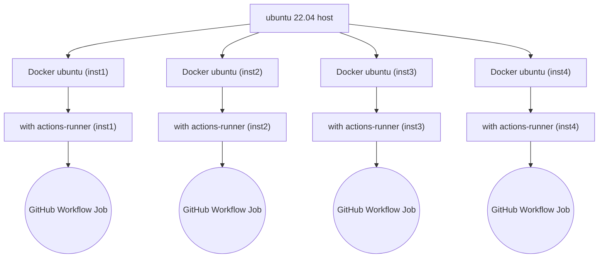
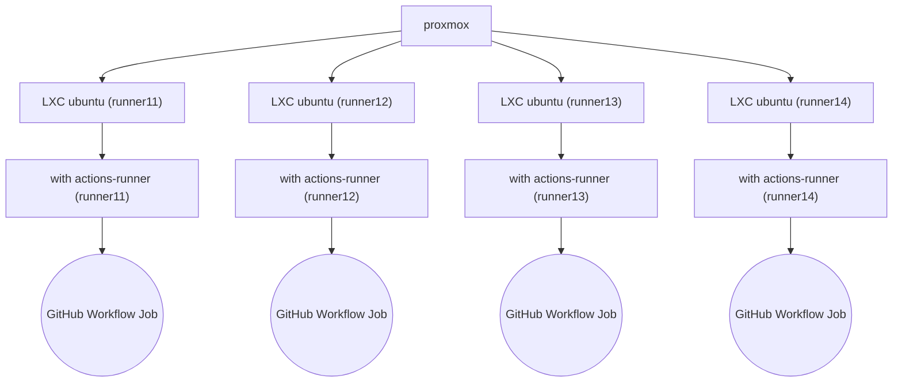

# Building LibreELEC
## Using GitHub Actions Workflows CI/CD

The LibreELEC Team have developed CI/CD based on **GitHub Actions _Workflows_** to enable **continuous delivery** of *nightly* and *release* **images** and **addons**.

Both tested scenarios below can be deployed to provide support for your **GitHub Actions**.
The customise build guides will help you deploy your **GitHub Action _Runners_** ready to build **LibreELEC**.

- [Build github actions runner/s as docket container/s](build-docker-gha-runner.md)

- [Deploy a github actions runner on LXC (one per LXC)](build-lxc-gha-runner.md)

## Information that you should take into consideration before building your repositories **Runners**.

## Future CI/CD
- Contributions are welcome
- Some ideas
- [ ] fix the docker execution to use github syntax
- [ ] simplify calling workflows (nightly-yyy.yml) use as "defaults" style
- [ ] matrix builds
  - https://github.com/AcademySoftwareFoundation/OpenColorIO/blob/4ab4a926f8312d2354a950247a3375dde4992396/.github/workflows/ci_workflow.yml
- [ ] add CI functionality to LE code
- [ ] add capability of make_helper cleaning one directory only
- [ ] logging
  - so we can actually get the logs (as ephemeral means that they are deleted)
  - https://docs.github.com/en/actions/using-workflows/storing-workflow-data-as-artifacts
  - https://github.com/actions/upload-artifact
